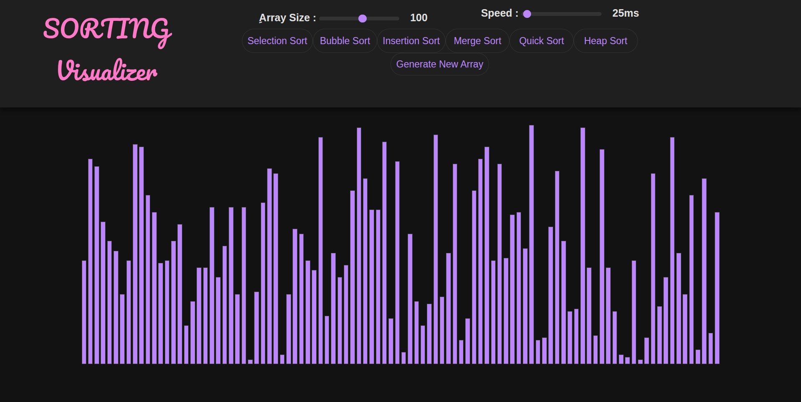
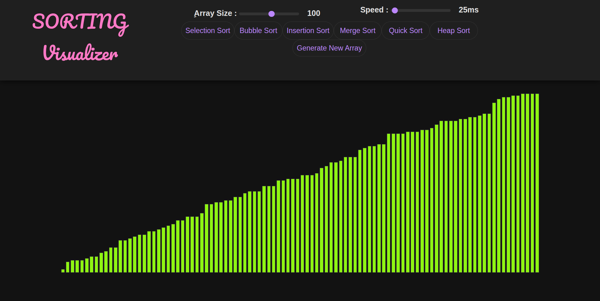

# Sorting Visualizer

An interactive and visually appealing tool to understand how different sorting algorithms work, built using **HTML**, **CSS**, and **JavaScript**.



## ✨ Features

- 🎥 **Animated Sorting** – Real-time bar animations to show step-by-step sorting progress.
- 🎛️ **Control Panel** – Adjust array size and sorting speed dynamically.
- 🔘 **Multiple Algorithms** – Visualize and compare:
  - Selection Sort
  - Bubble Sorta
  - Insertion Sort
  - Merge Sort
  - Quick Sort
  - Heap Sort
- 🌑 **Dark Mode UI** – A sleek and modern dark theme.
- 🔊 **Sound Feedback** – Optional beep sounds during sorting (via `beep.js`).

---

## 🖼️ Screenshots

### 🧩 Initial State


### ✅ Sorted State


---
## 📂 Project Structure

```plaintext
├── App/
│   ├── beep.js               # Optional sound
│   ├── script.js             # Core logic
│   └── img/
│       ├── mainpage.png      # UI screenshot
│       └── sorted.png        # Sorted result screenshot
├── style/
│   ├── index.css             # Styling for dark theme and sliders
│   └── Fonts/
│       └── Pacifico-Regular.woff2
├── index.html                # Main page
├── LICENSE                   # License info
└── README.md                 # You're reading it!
=======
# sorting-visualizer
